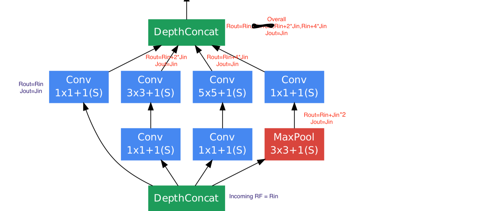
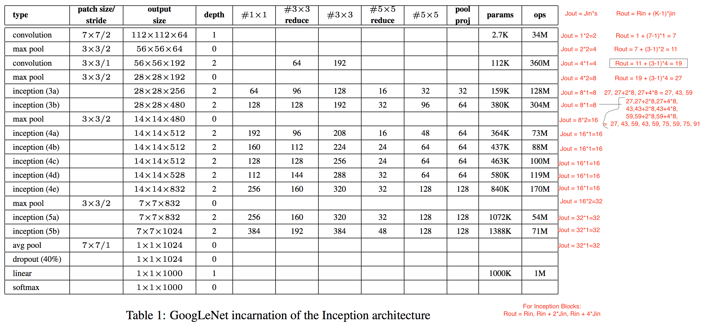

# 7A
For Finding overall RF, We first find receptive field calculation of Inception module.
Notice That inception module retains input dimension. 

As a result we can calculate the Paddings and strides, and hence calculate RF for the inception module.



So we find rules for inception module.
```python
Rout = Rin, Rin + 2*Jin, Rin + 4*Jin
Jout = Jin
```

Now lets try for inception, 1st few layers.


Final Receptive Field is calculated by our program (rf_finder.py and RF-Finder.ipynb).

```bash
[267,
 283,
 299,
 315,
 331,
 347,
 363,
 379,
 395,
 411,
 427,
 443,
 459,
 475,
 491,
 507,
 523,
 539,
 555,
 571,
 587,
 603,
 619,
 635,
 651,
 667,
 683,
 699,
 715,
 731,
 747,
 763,
 779,
 795,
 811,
 827,
 843,
 859,
 875,
 891,
 907]
```


